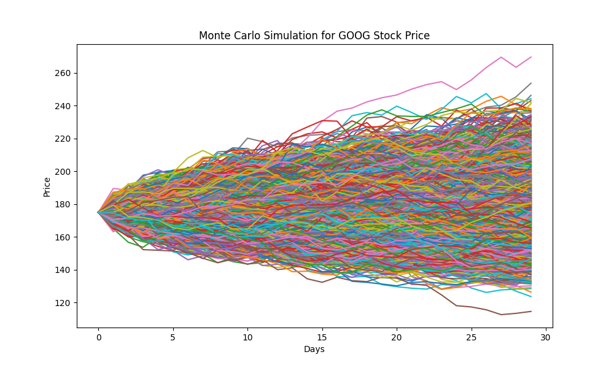

# 📈 Monte Carlo Simulation and Value at Risk (VaR) Analysis 📊

Welcome to the **Monte Carlo Simulation and Value at Risk (VaR) Analysis** project! 🎉 This project is designed to help 
you understand the future price movements of a stock using advanced statistical techniques. Whether you're a finance enthusiast, a data science learner, or just curious about stock market predictions, this project is for you! 🚀

---

## 🌟 Project Overview

This project uses **Monte Carlo Simulation** to predict the future price of a stock (in this case, **Google (GOOG)**) 
and calculates the **Value at Risk (VaR)** to assess the potential risk associated with the investment. Here's what you 
will find in this project:

1. **Historical Stock Data Download**: Fetch historical stock data using the `yfinance` library.
2. **Daily Returns and Statistics**: Calculate the daily returns, mean (mu), and standard deviation (sigma) of the stock. 
These values will be used in the Monte Carlo Simulation formula to generate future price paths.
3. **Monte Carlo Simulation**: Simulate thousands of possible future price paths for the stock using Geometric 
Brownian Motion (GBM).
4. **Visualization**: Plot the simulated price paths to visualize potential future outcomes.
5. **Value at Risk (VaR)**: Calculate the VaR to understand the potential loss at a 99.5% confidence level.

---

## 🛠️ Tools and Libraries Used

- **Python**: The backbone of this project.
- **yfinance**: To download historical stock data.
- **NumPy**: For numerical computations and random number generation.
- **Pandas**: For data manipulation and analysis.
- **Matplotlib**: For visualizing the simulation results.

---

## 📝 Analysis

**Monte Carlo Simulation**

The Monte Carlo Simulation provides a range of possible future stock prices based on historical data.
By simulating thousands of price paths, we can estimate the expected future price and the uncertainty around it.
The visualization of these paths helps in understanding the potential volatility and risk associated with the stock.

**Value at Risk (VaR)**

VaR is a crucial metric in **risk management**. It quantifies the potential loss in value of a stock over a specified
time period at a given confidence level. In this project, we calculate the VaR at a 99.5% confidence level,
which means there is a 0.5% chance that the loss will exceed this value. However, it's important to note that VaR
does not capture the magnitude of losses beyond this threshold. In other words, while VaR tells us the maximum
expected loss with 99.5% confidence, it does not provide information about how severe the losses could be in the
worst-case scenarios (the remaining 0.5%). Therefore, VaR should be used in conjunction with other risk management
tools, such as Expected Shortfall (ES), to get a more comprehensive understanding of potential risks.

**Expected Shortfall (ES)**

Expected Shortfall (ES) enhances the insights provided by VaR by calculating the average loss in scenarios where losses 
exceed the VaR threshold. This metric is particularly valuable for understanding the potential impact of extreme market
conditions, offering a more comprehensive view of tail risks. In this project, we compute the ES at a 99.5% confidence 
level, which reveals the average loss when losses surpass the VaR. By combining VaR and ES, we can better assess both the 
likelihood and severity of potential losses, enabling more informed risk management decisions

----
Thank you for exploring this project! 🙌 Hope this Monte Carlo Simulation and VaR analysis provides you with
valuable insights into stock price predictions and risk assessment. If you have any questions, suggestions,
or feedback, feel free to reach out! 😊

Happy coding and happy investing! 💻📈

Disclaimer: This project is for educational purposes only. The predictions and analyses provided are based on
historical data and should not be considered as financial advice. Always do your own research before making any
investment decisions. 📚💡

🎉 Enjoy the project! 🎉
